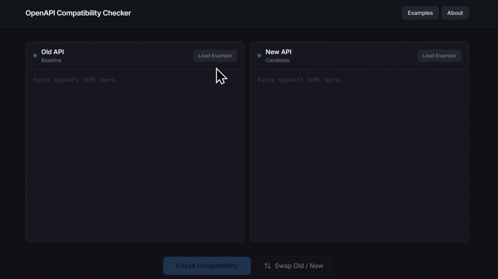

# OpenAPI Compatibility Checker



A formally verified tool for checking backward compatibility between two OpenAPI specifications.

---

## What it does

Checks whether a new API version is backward compatible with an old one.

Returns either:
- ✅ compatible
- ❌ breaking change with explanation

---

## Architecture

OpenAPI specs are parsed in Python and formally verified in Agda. The compatibility result is then displayed to the user in the frontend.

- **Frontend** – UI for input and results (`apps/frontend`)
- **Backend** – runs the parser and verification (`apps/backend`)
- **Parser (Python)** – translates OpenAPI → typed representation / Agda (`parser/`)
- **Core (Agda)** – defines and checks compatibility (`agda/`)

---

## Quick Start

```bash
# Backend
cd apps/backend
python -m pip install -r requirements.txt
python -m uvicorn app.main:app --host 127.0.0.1 --port 8000 --reload

# Frontend
cd apps/frontend
npm install
$env:VITE_BACKEND_URL="http://127.0.0.1:8000"
npm run dev
```
Open the UI and paste two OpenAPI specifications to check compatibility.

---

## Development

Type-check the Agda formalisation:

```bash
cd agda
agda Everything.agda
```

---

## Project Structure

```text
.
├── agda/           # Formal core
├── apps/
│   ├── backend/    # FastAPI job manager/service
│   └── frontend/   # React UI
├── docs/           # Notes, design write-ups, drafts
├── drift-example/  # Early API drift example
├── parser/         # Translation pipeline
├── specs/          # Example + test OpenAPI specifications
└── report.pdf      # Project report
```