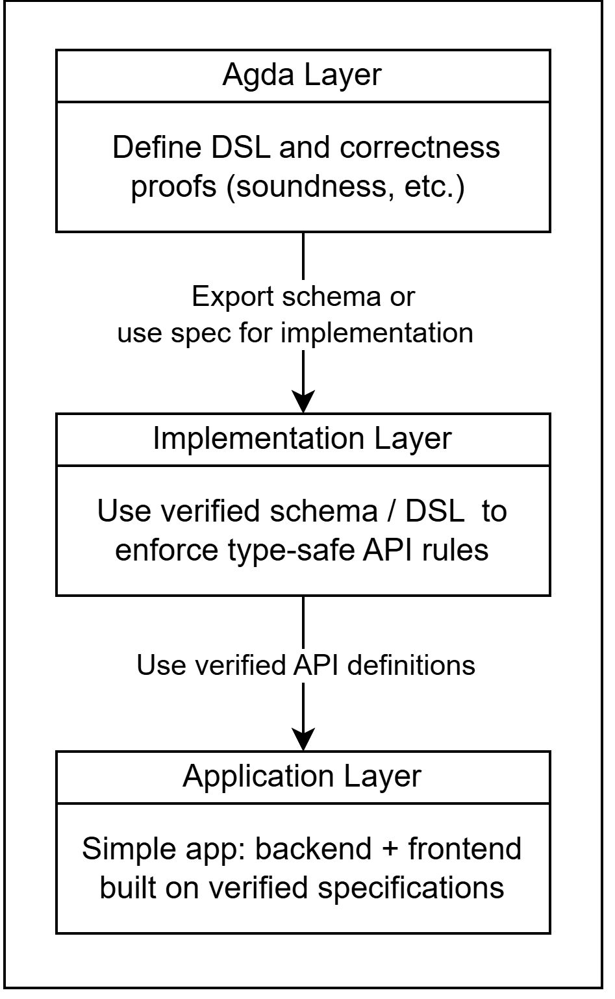

# Proposed System Architecture

This document outlines the system architecture for the verified REST DSL, which integrates formal verification with practical web application development. The architecture describes how the system moves from a formally proven specification, defined in Agda, to a fully functioning, type-safe implementation.

The flowchart below shows how correctness that is established at the specification level is preserved through implementation and deployment.

**Agda Layer** \- Defines the core language and its typing rules within Agda. Formal proofs guarantee key properties such as **soundness** and **consistency**, ensuring that every defined endpoint adheres to its declared schema

**Implementation Layer** \- Bridges the verified Agda specification to a practical programming environment (e.g., TypeScript or Python). It enforces the same guarantees at compile time by generating type-safe bindings or validation logic derived from the Agda specification

**Application Layer** \- Represents the real-world backend and frontend applications built on the verified schema. Both sides share the same verified types, eliminating client-server drift and preventing mismatched API interactions by construction

